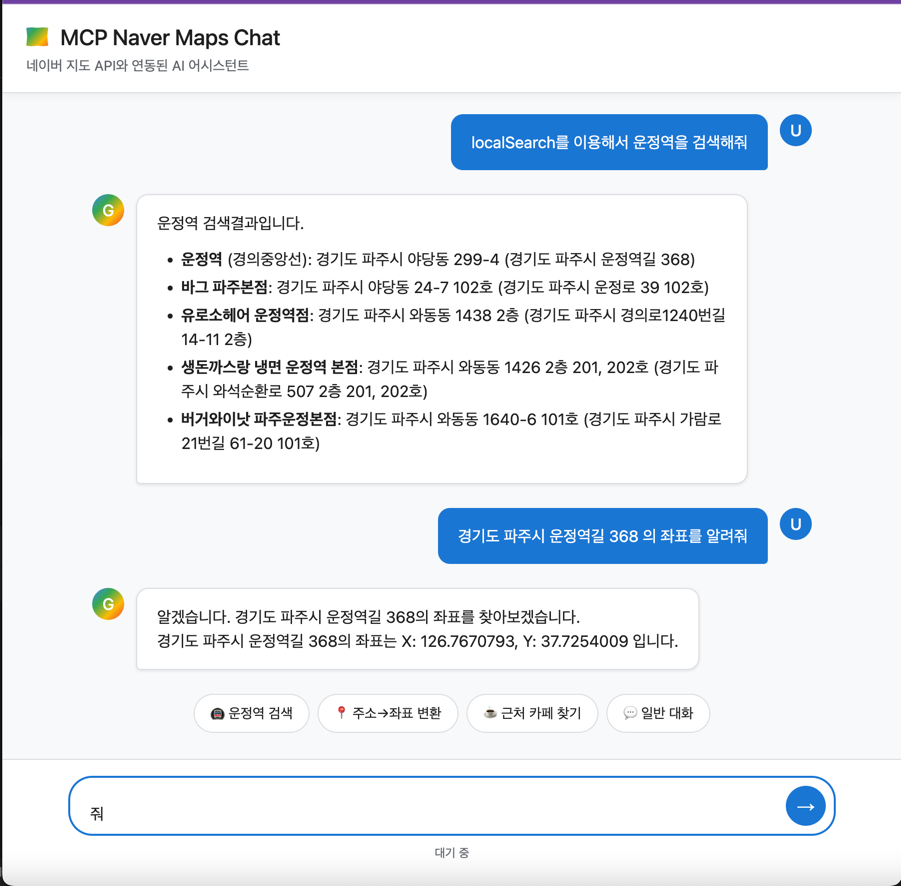

# MCP Naver Maps Chat

네이버 지도 API와 연동된 AI 채팅 서비스입니다. MCP(Model Context Protocol)를 통해 Spring AI와 네이버 지도 서비스를 연결하여 위치 기반 질의응답을 제공합니다.

## 🏗️ 아키텍처

```
[사용자/웹앱] → [Spring Boot + Spring AI]
                      │
                      ├─(MCP Client)──▶  [MCP 서버 (naver-maps)]
                      │                     ├─ geocode() - 주소→좌표 변환
                      │                     └─ localSearch() - 장소 검색
                      │
                      └─(Vertex AI Gemini)  ← Tool Calling으로 MCP 도구 사용
```

## ✨ 주요 기능

- **실시간 채팅**: Server-Sent Events를 활용한 스트리밍 채팅
- **위치 검색**: 네이버 지도 API를 통한 장소 검색 및 주소 변환
- **AI 통합**: Google Vertex AI Gemini와 MCP 프로토콜 연동
- **웹 UI**: 직관적인 채팅 인터페이스 제공

## 🛠️ 기술 스택

- **Backend**: Spring Boot 3.5, Kotlin, Spring AI
- **AI**: Google Vertex AI Gemini 2.0 Flash
- **Integration**: MCP (Model Context Protocol)
- **Frontend**: HTML5, JavaScript, Server-Sent Events
- **API Documentation**: SpringDoc OpenAPI

## 🚀 시작하기

### 필수 요구사항
- JDK 21+
- Google Cloud Project (Vertex AI 활성화)
- 네이버 지도 MCP 서버

### 실행 방법
```bash
./gradlew bootRun
```

애플리케이션이 시작되면 다음 URL에서 확인할 수 있습니다:
- 채팅 UI: http://localhost:9090/sse-test.html
- API 문서: http://localhost:9090/swagger-ui.html

## 📱 사용 예시



### 지원하는 질의 유형
- "운정역을 검색해줘" → localSearch 도구 사용
- "서울특별시 강남구 테헤란로 152의 좌표를 알려줘" → geocode 도구 사용
- "가까운 카페를 찾아줘" → localSearch 도구 사용
- 일반적인 대화도 가능

## 🔧 설정

`src/main/resources/application.yml`에서 다음 설정을 확인하세요:

```yaml
spring:
  ai:
    vertex:
      ai:
        gemini:
          project-id: ${GOOGLE_CLOUD_PROJECT_ID}
          location: ${GOOGLE_CLOUD_LOCATION:us-central1}
```

## 📡 API 엔드포인트

- `POST /chat/ask` - 동기식 채팅
- `GET /chat/stream` - 스트리밍 채팅 (SSE)
- `GET /mcp-debug/tools` - MCP 도구 목록 조회